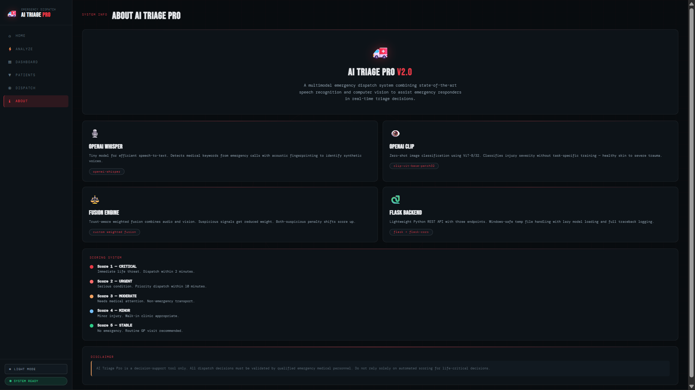
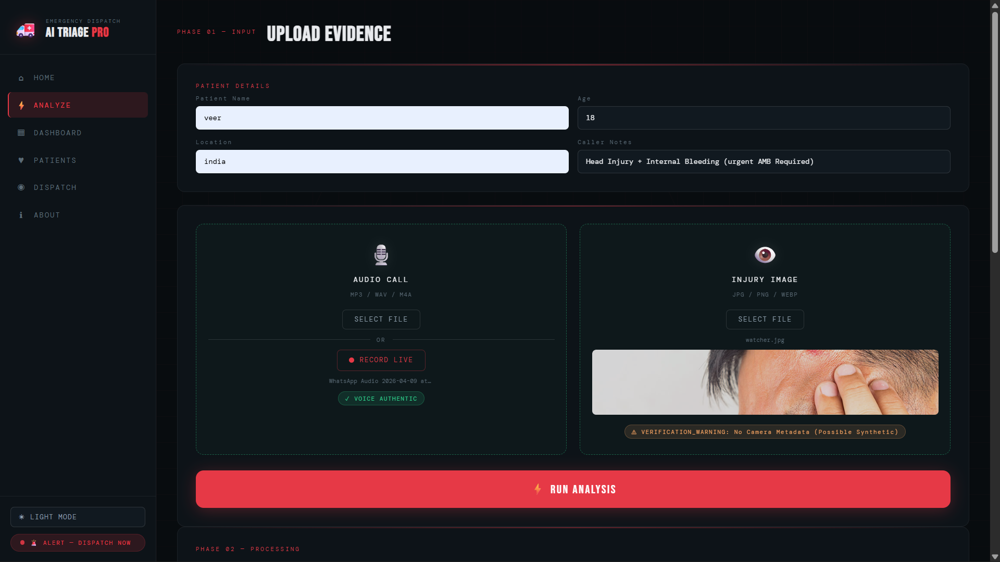
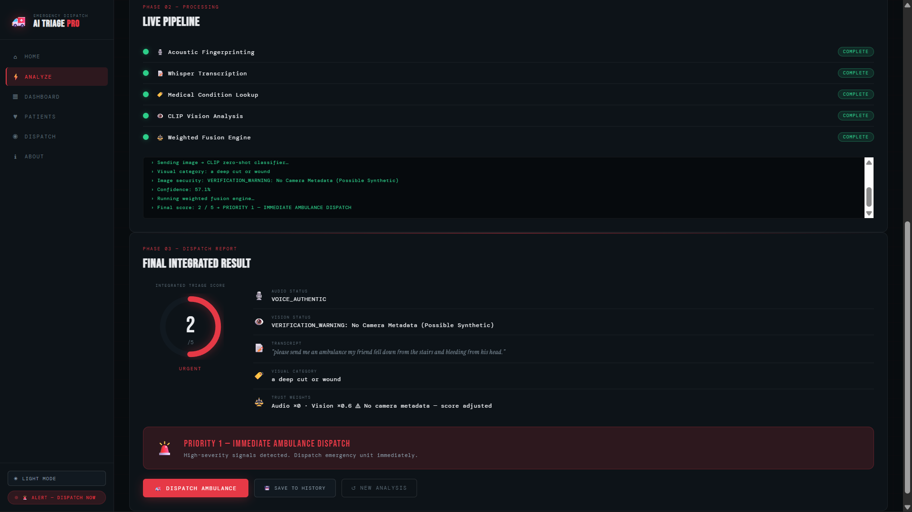
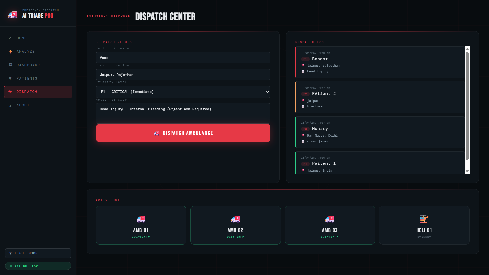
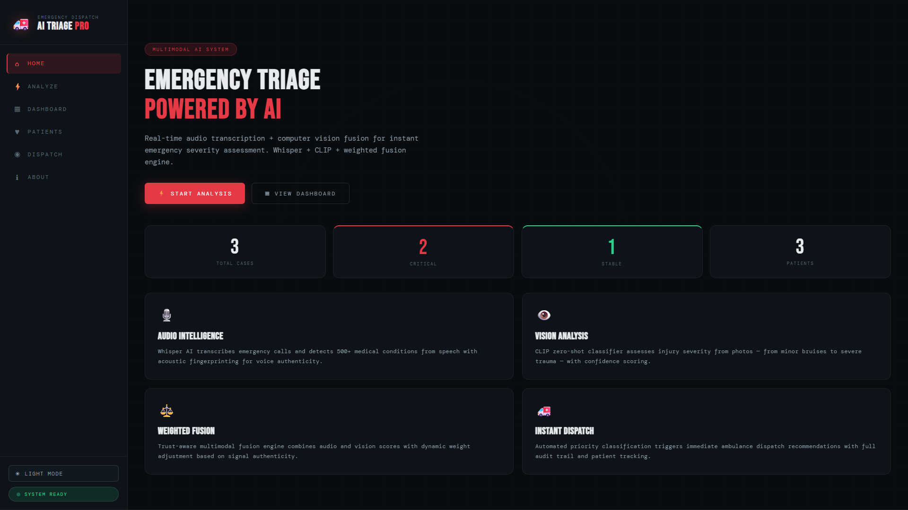

<div align="center">

```
 █████╗ ██╗    ████████╗██████╗ ██╗ █████╗  ██████╗ ███████╗    ██████╗ ██████╗  ██████╗ 
██╔══██╗██║    ╚══██╔══╝██╔══██╗██║██╔══██╗██╔════╝ ██╔════╝    ██╔══██╗██╔══██╗██╔═══██╗
███████║██║       ██║   ██████╔╝██║███████║██║  ███╗█████╗      ██████╔╝██████╔╝██║   ██║
██╔══██║██║       ██║   ██╔══██╗██║██╔══██║██║   ██║██╔══╝      ██╔═══╝ ██╔══██╗██║   ██║
██║  ██║██║       ██║   ██║  ██║██║██║  ██║╚██████╔╝███████╗    ██║     ██║  ██║╚██████╔╝
╚═╝  ╚═╝╚═╝       ╚═╝   ╚═╝  ╚═╝╚═╝╚═╝  ╚═╝ ╚═════╝ ╚══════╝    ╚═╝     ╚═╝  ╚═╝ ╚═════╝ 
```

# 🚑 AI TRIAGE PRO — V2.0
### *Multimodal Emergency Dispatch System*

[](https://python.org)
[](https://flask.palletsprojects.com)
[](https://github.com/openai/whisper)
[](https://huggingface.co/openai/clip-vit-base-patch32)
[](LICENSE)

> **🏆 4th Place — HackNexus 2.0** | Organized by Arya College of Engineering

*Real-time audio transcription + computer vision fusion for instant emergency severity assessment.*

</div>

---

## 📌 Overview

**AI Triage Pro** is a multimodal AI-powered emergency dispatch system that combines:
- 🎙️ **Audio Intelligence** — OpenAI Whisper transcribes emergency calls and detects 500+ medical conditions via acoustic fingerprinting
- 👁️ **Vision Analysis** — CLIP zero-shot classifier assesses injury severity from uploaded images with confidence scoring
- ⚖️ **Weighted Fusion Engine** — Trust-aware engine combines both signals, penalizes suspicious inputs, and outputs a triage priority score
- 🚨 **Instant Dispatch** — Priority classification triggers immediate ambulance dispatch recommendations with a full audit trail

The system was designed to assist emergency responders in triage decisions — reducing response time and improving patient outcomes.

---

## 🎯 Triage Scoring System

| Score | Severity | Action | Response Time |
|-------|----------|--------|--------------|
| 🔴 **1** | CRITICAL | Immediate life threat | Dispatch within 2 minutes |
| 🔴 **2** | URGENT | Serious condition | Priority dispatch within 10 minutes |
| 🟠 **3** | MODERATE | Needs medical attention | Non-emergency transport |
| 🔵 **4** | MINOR | Minor injury | Walk-in clinic appropriate |
| 🟢 **5** | STABLE | No emergency | Routine GP visit recommended |

---

## 🧠 System Architecture

```
┌─────────────────────────────────────────────────────────┐
│                    AI TRIAGE PRO v2.0                   │
├───────────────────────┬─────────────────────────────────┤
│   AUDIO PIPELINE      │      VISION PIPELINE            │
│                       │                                 │
│  📞 Emergency Call    │   📸 Injury Photo              │
│       ↓               │        ↓                        │
│  Acoustic             │   EXIF Metadata                 │
│  Fingerprinting       │   Authenticity Check            │
│       ↓               │        ↓                        │
│  Whisper Tiny         │   CLIP Relevance                │
│  Transcription        │   Filter (Round A)              │
│       ↓               │        ↓                        │
│  Medical CSV          │   CLIP Injury                   │
│  Condition Lookup     │   Classification (Round B)      │
│       ↓               │        ↓                        │
│  Audio Score (1–5)    │   Vision Score (1–5)            │
└─────────────┬─────────┴────────────────┬────────────────┘
              │                          │
              └────────────┬─────────────┘
                           ↓
               ┌────────────────────────┐
               │   WEIGHTED FUSION      │
               │   ENGINE (app.py)      │
               │                        │
               │  Trust Weights Applied │
               │  Suspicious Penalty    │
               │  Final Score (1–5)     │
               └───────────┬────────────┘
                           ↓
               ┌────────────────────────┐
               │   DISPATCH DECISION    │
               │  P1 → Immediate AMB    │
               │  P2–P5 → Walk-in/GP    │
               └────────────────────────┘
```

---

## ⚙️ Tech Stack

| Layer | Technology |
|-------|-----------|
| **Frontend** | HTML5, CSS3, Vanilla JS, Chart.js |
| **Backend** | Python 3.9+, Flask, Flask-CORS |
| **Audio AI** | OpenAI Whisper (tiny), Librosa |
| **Vision AI** | CLIP ViT-B/32 (via HuggingFace Transformers) |
| **Fusion** | Custom Weighted Fusion Engine |
| **Security** | Acoustic Fingerprinting, EXIF Metadata Analysis |
| **Data** | Medical Conditions CSV (500+ conditions mapped to triage scores) |

---

## 🗂️ Project Structure

```
ai-triage-pro/
│
├── app.py               # Flask REST API — main server + fusion endpoint
├── listener.py          # Audio pipeline — Whisper + acoustic fingerprinting
├── watcher.py           # Vision pipeline — CLIP + EXIF metadata check
├── fusion_engine.py     # Standalone CLI fusion engine (mirrors app.py logic)
├── medical_data.csv     # 500+ medical conditions → triage score mappings
│
├── index.html           # Frontend UI (single-page app)
├── style.css            # Dark/light theme, premium UI styling
├── script.js            # Frontend logic — API calls, pipeline visualization
│
└── requirement.txt      # Python dependencies
```

---

## 🚀 Getting Started

### Prerequisites

- Python 3.9+
- `ffmpeg` installed and added to PATH
  - Windows: [Download here](https://ffmpeg.org/download.html) → extract → add `/bin` to PATH
  - Linux/Mac: `sudo apt install ffmpeg` or `brew install ffmpeg`

### Installation

```bash
# 1. Clone the repository
git clone https://github.com/xyresiiic/AI-TRIAGE-PRO-Project-.git
cd AI-TRIAGE-PRO-Project-

# 2. Install dependencies
pip install -r requirement.txt

# 3. Run the server
python app.py
```

### Usage

```
Open your browser → http://localhost:5000
```

1. **ANALYZE** — Enter patient details, upload an audio call (MP3/WAV/M4A) and/or an injury image (JPG/PNG/WEBP)
2. **RUN ANALYSIS** — Watch the live pipeline process both modalities in real-time
3. **DISPATCH** — Review the integrated triage score and dispatch recommendation
4. **DASHBOARD** — Track all cases, severity distribution, and patient history

### CLI Usage (Fusion Engine Only)

```bash
python fusion_engine.py audio.mp3 image.jpg
```

---

## 🔌 API Endpoints

| Method | Endpoint | Description |
|--------|----------|-------------|
| `GET` | `/` | Serves the frontend UI |
| `POST` | `/api/analyze/audio` | Transcribe + score an audio file |
| `POST` | `/api/analyze/image` | Classify + score an injury image |
| `POST` | `/api/analyze/fuse` | Weighted fusion of both results |
| `GET` | `/api/health` | Health check — returns version info |

### Example Fusion Request

```json
POST /api/analyze/fuse
{
  "audio_result": {
    "audio_triage_score": 1,
    "security": "VOICE_AUTHENTIC",
    "transcript": "my friend is bleeding from the head",
    "detected_condition": "head injury"
  },
  "vision_result": {
    "image_triage_score": 2,
    "security": "VERIFICATION_WARNING: No Camera Metadata",
    "top_category": "a deep cut or wound"
  }
}
```

### Example Response

```json
{
  "final_score": 2,
  "severity": "URGENT",
  "is_critical": true,
  "action": "PRIORITY 1 — IMMEDIATE AMBULANCE DISPATCH",
  "weights": { "audio": 1.0, "vision": 0.6 },
  "trust_flags": {
    "audio_suspicious": false,
    "vision_suspicious": true,
    "penalty_applied": true
  }
}
```

---

## 🛡️ Security Features

- **Acoustic Fingerprinting** — Detects synthetic/TTS voices using spectral centroid variance analysis
- **EXIF Metadata Verification** — Flags images with missing camera metadata as possibly synthetic
- **CLIP Relevance Filter** — Rejects non-medical images before injury classification
- **Trust-Weighted Fusion** — Suspicious signals receive reduced weight (0.5–0.6×) in the final score
- **Suspicion Penalty** — Score shifted toward stable when all submitted modalities are flagged

---

## 📸 Screenshots

| Home | Analyze |
|------|---------|
|  |  |

| Live Pipeline & Results | Dispatch Center |
|------------------------|-----------------|
|  |  |

| About |
|-------|
|  |

> Screenshots are located in the `/screenshots` folder of this repo.

---

## 👥 Team

Built with 🔥 at **HackNexus 2.0** — *24 hours, 4 people, 1 mission.*

| Name | Role | GitHub |
|------|------|--------|
| **Veer Pratap Singh** | UI/UX & Design | [@xyresiiic](https://github.com/xyresiiic) |
| **Poorvangika Kanwar** | Backend, AI Training & Presentation | [@POORVANGIKA](https://github.com/POORVANGIKA) |
| **Shivam Maurya** | Frontend & Website | [@scriptedbyshivam](https://github.com/scriptedbyshivam) |
| **Suman Vyas** | Research & Presentation | — |

---

## ⚠️ Disclaimer

> AI Triage Pro is a **decision-support tool only**. All dispatch decisions must be validated by qualified emergency medical personnel. Do not rely solely on automated scoring for life-critical decisions.

---


<div align="center">

**Made with ❤️ at HackNexus 2.0 | Arya College of Engineering**

*"Building tech with real-world stakes hits different."*

</div>
